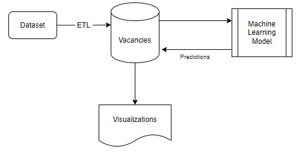

### Database

To create “Predicting Labour Vacancies in Various Canadian Sectors” the team leveraged a Stats Canada Dataset <insert hyperlink to data origin> to create a PostgreSQL Database that could be connected to a database engine, allowing connection and analysis via Pandas.

The database integrates into the below data flow:

Entity Relationship Diagram (ERD) was created as below to map out the design of the database. 

To create “Predicting Labour Vacancies in Various Canadian Sectors” the team leveraged PostGresSQL to host and interact with the database. 

**_ETL Process_**
At a high level the followings steps were followed to transform the original dataset into usable data ready for further processing and interpretation.
1. Data Quality 
    - Dataset contained poor quality data and was classified using Status column. Data was classified using A-F,x,'..' and null values. We retained only A-D to ensure high quality data. 
2. Data Volume
    - Key aspects we are interested in are Vacancies and Average Wage. These subsets of data were identified using Statistics column and retained. 
    - We also decided to focus on Full Time and Part Time metrics which we filtered from Job Characteristics column. 
    - Redundant columns were dropped and NOC column split into code and description. 
3. Data Readiness
    - Specific data required for Machine Learning models at Broad NOC level was placed into one table for easy connection from Pandas to run modelling.
    - DataFrames were exported to CSV files, ready to be loaded into Database.

**_Database_**
AWS RDS instance was generated to host the DB and provide a core data source which could be used simultaneously by all team members. There was a database engine created to allow each team member to connect to the database directly within their own local notebooks.

**_Joining Database Tables_**
Within pgAdmin, the team has created a join to pull the average wage of each NOC code. This is inclusive of all NOC and sub NOC codes and is also inclusive of both Part time and Full time Job Types to produce a single average wage for this NOC code.

