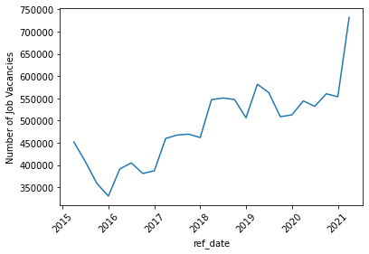
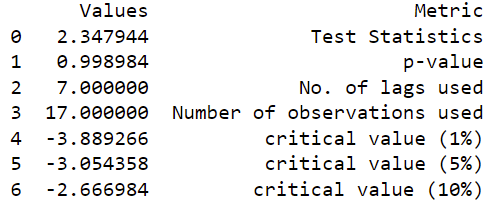
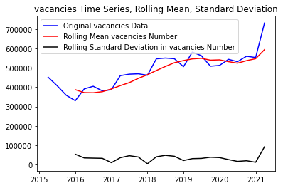
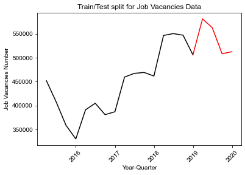

# SARIMAX Machine Learning Model
The main objectives of using time series SARIMAX machine learning model is to understand the underlying patterns and past dynamics of the projects dataset and predict the number of vacancies on Canada and province levels. It is also suited for data sets that have seasonal cycles and trend.

## Description of preliminary data preprocessing
The folowing steps are performed as the nescessary preprocessing for the model:
1. Slicing data for 'Canada', 'Total, all occupations' in NOC, and 'Total, all occupations' in job_char
2. Remove unnecessary columns
3. Converting the REF_DATE column into a datetime object
4. Setting the REF_DATE column as the dataframe index

##  Description of preliminary feature engineering and preliminary feature selection, including their decision-making process
*  feature engineering:
    Impute missing data for Q2 & Q3 2020 Canada and province level
* Time series analysis including stationary, autoregression and trend decomposition tests were performed to undertand the chracteristics of the data. it helped in understanding and facilatating feature selection:
 * visualizing the time series data
 

 * checking for stationary, a stationary time series will not have any trends or seasonal patterns. We used the Dickey Fuller test to check for stationarity in our data. 
 
 
 
  Our data is not stationary as p value is higher than 0.05.

 * Checking for autocorrelation in time series data, this is a measure of how correlated time series data is at a given point in time with past values. 
 
 
 
 
 The data is autocorrelated and the results are shown below:

    One Quarter Lag:  0.8145162959523269
    Two Quaretrs Lag:  0.7294501466461943
    Three Quaretrs Lag:  0.685410879335562
    Four Quaretrs Lag:  0.7399548793483853

    * Checking for Trend decomposition to visualize the trends in time series data
    

    From this plot, we can clearly see the increasing trend in number of vacancies and the seasonality patterns in the rise and fall in values each year.

* Identification of model parameters required a grid search to find the combination of prameters that gives the best accuracy metrics.

Model accuaracy metrics:
* Explained Variance Score : 0.12
* Mean Square Error : 64963
* Root Mean Square Error : 254.9
* Coefficient of determination Training (R^2) : -0.063

## Description of how data was split into training and testing sets

The data was split 85% training and 15% testing chronologically for the first model creation

##  Explanation of model choice, including limitations and benefits
SARIMA model is chosen to predict the number of vancancies on Canada and on province levels as the data presents both components of trend and seasonality. It is one of the easiest and effective machine learning algorithm to performing time series forecasting.

Benifits:
* best used for time series with seasonality as it  allows for long-term trend and seasonal effects.
* easy to intrept the results

Limitations:
* high RMSE for provinces with high variation in number of vancacies
* limited ability to deal with outliers

